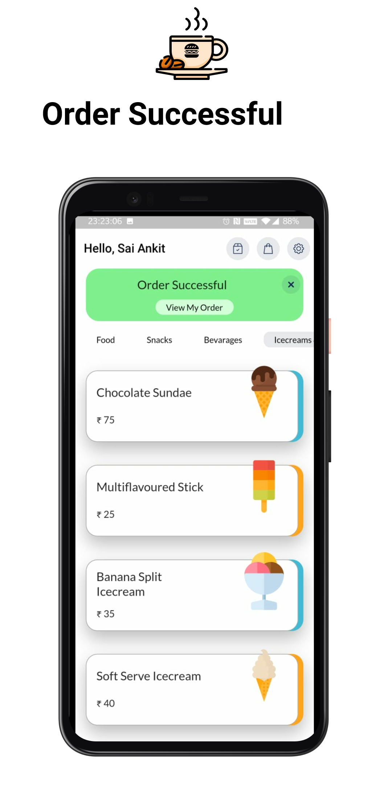

<p align="center">

<h1 align="center">
    OfficeCafeteria
</h1>
</p>

------

<h4 align="center">
  Flutter App
  to enable the people at Office to order items at their own Cafeteria
</h4>

------
<h4 align = "center" >Feature Set <h4>

|    |    |    |
|---|---|---|
|    |    |    |
|    |    |    |
|    |    |    |
|    |    |    |
|   |    |    |

------


#### How to use the app locally on your machine ?

<u>Requirements</u>

1. Flutter installed on your machine.
2. A simulator/emulator for running the application.

**Step #1** : Clone this repository using

``` git clone https://github.com/saiankit/officeCafeteria.git ```

**Step #2** : Run the following command in the directory

``` flutter packages get```

**Step #3**: Open a simulator / emulator and run the application

``` flutter run```

- - - -
### Created and Maintained by
#### Sai Ankit ( [Code Studio Sai Ankit](https://www.youtube.com/c/CodeStudioSaiAnkit?sub_confirmation=1) )
